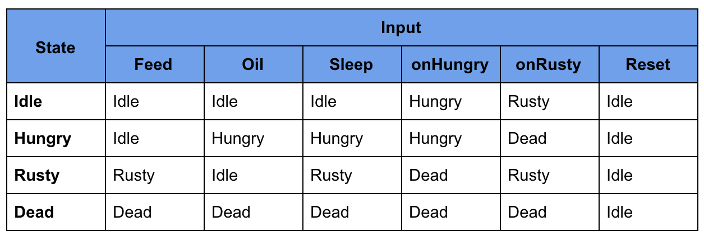
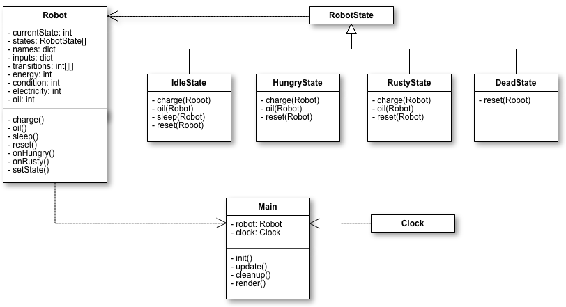

Robo Child
=====================

Robo Child is a strategy game where players take care of a robot and train its A.I. with puzzles.

## Architecture

A finite state machine is used to model the A.I. for the robot. Here is the state table:

The state pattern is used to design the classes for the robot. This is the class diagram:

An API will be created from the robot's properties. This will allow the app to be easily ported to other platforms including the web and mobile. It will also allow programs access the data so they can use the robot's computational power.

## Available Scripts

In the project directory, you can run:

### `npm run server`

Starts a node server for the app. Open [http://localhost:5000](http://localhost:5000) to view in the browser.

### `npm start`

Runs the app in the development mode. 
Open [http://localhost:3000](http://localhost:3000) to view it in the browser.

The page will reload if you make edits. 
You will also see any lint errors in the console.

### `npm test`

Launches the test runner in the interactive watch mode. 
See the section about [running tests](#running-tests) for more information.

### `npm run build`

Builds the app for production to the `build` folder. 
It correctly bundles React in production mode and optimizes the build for the best performance.

The build is minified and the filenames include the hashes. 
Your app is ready to be deployed!

